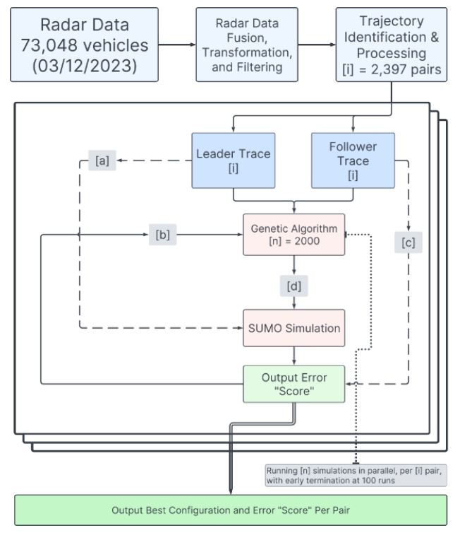

# Calibrating Car-Following Models using SUMO-in-the-loop and Vehicle Trajectories from Roadside Radar

[](https://opensource.org/licenses/MIT)

## Overview

Code to accompany "Calibrating Car-Following Models using SUMO-in-the-loop and Vehicle Trajectories from Roadside Radar"

Trajectory pre-processing code is not included in this repository. The pre-processed trajectories are available upon request.

### Paper Figure Directory

1. Figure 1: Not included in this repository
2. Figure 2: Not included in this repository
3. Figure 3: `./notebooks/post_processing.ipynb`
4. Figure 4: `./notebooks/post_processing.ipynb`
5. Figure 5: `./notebooks/post_processing.ipynb`
6. Figure 6: `./notebooks/post_processing.ipynb`
7. Figure 7: `./notebooks/post_processing.ipynb`
8. Figure 8: `./notebooks/post_processing.ipynb`
9. Figure 9: `./notebooks/post_processing.ipynb`

### Calibration Architecture



## Setup & Installation

### Python

1. Create a virtual environment: `python3 -m venv venv`
2. Activate the virtual environment: `source venv/bin/activate`
3. Install the requirements: `pip install -r requirements.txt`

### Additional for Running SA

1. Install [SUMO](https://sumo.dlr.de/docs/Installing.html) and add the `bin` directory to your `PATH` environment variable.
   - Set the `SUMO_HOME` environment variable to the path of your SUMO installation.

### Directory Structure

```
.
├── config
│   └── sumo-pipelines
│       └── ...
├── data
│   ├── processed_followers.parquet  # Pre-processed follower trajectories
│   └── paper_calibration_results
│       ├── calibrated_trajectories.parquet  # Trajectories with calibrated car-following models
│       ├── paper_results.parquet # Results of the calibration analysis
│       ├── idm_results.parquet # Results of the IDM calibration including optimal parameters
│       ├── krauss_results.parquet # Results of the Krauss calibration including optimal parameters
│       └── w99_results.parquet # Results of the W99 calibration including optimal parameter s
├── functions
│   ├── ...
│   ├── sumo_pipelines_adapter
│   │   └── ...
│   ├── trajectory_loaders
│   │   └── ...
│   └── trajectory_processing
│       └── ...
├── notebooks
│   └── post_processing.ipynb  # Post-processing of the calibration results
├── requirements.txt
└── sumo-xml
    ├── net.net.xml
    └── route.rou.xml
```

## Running the Calibration

Calibration is done using the `sumo-pipe` command from the [sumo-pipelines](https://github.com/mschrader15/sumo-pipelines) python library.

They use Ray to parallelize the simulations according to the above image. The number of parallel simulations can be configured using the ray start command:

```shell
ray start --head --port=6379 --num-cpus=<desired cpu num>"
```

All simulations rely on three environment variables. These must be set before running `ray start` and `sumo-pipe`:

1. `SUMO_HOME`: The path to your SUMO installation
2. `PYTHONPATH`: The path to `./src` must be added to the `PYTHONPATH` environment variable.
3. `PROJECT_ROOT`: The path to the root of this project. This is used to find the simulation data & set the output

### Calibration Configuration

The calibration analyis is configured by two YAML files:

1. `./config/sumo-pipelines/sumo_pipelines.yaml`
    - Defines the workflow and the Metadata
2. `./config/sumo-pipelines/<car follow model>_calibration.yaml`
    - Defines the parameter set and calibration specifics.

The full analysis with all three car-following models can be run using the following command:

```shell
export PROJECT_ROOT=$(pwd)
export PYTHONPATH="$PYTHONPATH:$(pwd)"
export DATA_PATH="$PROJECT_ROOT/data/calibration"

ray stop
ray start --head --num-cpus=<desired cpu num>

# IDM Defaults
sumo-pipe $PROJECT_ROOT/config/sumo-pipelines/sumo_pipelines.yaml $PROJECT_ROOT/config/sumo-pipelines/idm_defaults.yaml
# W99 Defaults
sumo-pipe $PROJECT_ROOT/config/sumo-pipelines/sumo_pipelines.yaml $PROJECT_ROOT/config/sumo-pipelines/w99_defaults.yaml
# Krauss Defaults
sumo-pipe $PROJECT_ROOT/config/sumo-pipelines/sumo_pipelines.yaml $PROJECT_ROOT/config/sumo-pipelines/krauss_defaults.yaml

# IDM Calibration
sumo-pipe $PROJECT_ROOT/config/sumo-pipelines/sumo_pipelines.yaml $PROJECT_ROOT/config/sumo-pipelines/idm_calibration.yaml
# W99 Calibration
sumo-pipe $PROJECT_ROOT/config/sumo-pipelines/sumo_pipelines.yaml $PROJECT_ROOT/config/sumo-pipelines/w99_calibration.yaml
# Krauss Calibration
sumo-pipe $PROJECT_ROOT/config/sumo-pipelines/sumo_pipelines.yaml $PROJECT_ROOT/config/sumo-pipelines/krauss_calibration.yaml

# pyenv deactivate
```

The results of the analysis will be stored according to the `Metadata.output_dir` parameter in the `./config/*.yaml` files.
